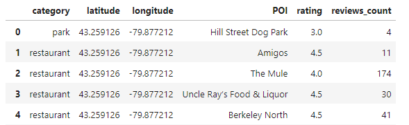

# Final-Project-Statistical-Modelling-with-Python

## Project/Goals
My goals in this project are:
- based on the prelimary information I defined the scope of the problem I am trying to analyse:
    - % of bikes available by station vs number of restaurants/parks in a radiius of 1000m
      and vs restaurant/park rstings
- Pull json files from different APIs
- set up a an API Key environment
- Use an EDA process to uderstand, clean and format the data
- learn to create a database using Sqlite/python
- practice visualization and analysing the outputs
- Use the regression and classification model to predict the dependant variable.

## Process
### Getting the Json files
At first, I pulled all the information of Montreal city with more than 700 stations however during the process I encountered some challenges with the limit of daily requests with yelp. I changed then the city to Hamilton with 143 stations.

### Parsing 
For every API I pulled a sample to uderstand the Json file structure and I also used Postman to visualize better the Json file
For FSQ and Yelp I define a 2 functions:
- First: to send, collect, and start the parsing process
- Second to map all and store information by station in a dataframe object
- final step was to conecatenate all stations dfi in one dF
- Note: 
    - when reading FSQ json I noticed that there was not a clear identificator to distinguish between POI type ( parks, restaurants) so
    I decided to run them seperately
    - Keeping the project scope in mind: 
        - from FSQ I collected :
        
        - from Yelp I collected:
        
    
    From the city bikes    
        - 
        
    - During the parsing process, I made sure that every record was related to the station row index as key to connect the final tables together

  
### Joining the tables
 - Data cleaning/formating was done seperately
 - dropped some not necessary columns/ empty rows after joining the tables
 - I broke the Yelp/FSQ:
     - splited each table by category, grouped them by count, mean rating by station and merge them based on the station ID key 
         using outer joining
     -  Merged both tables with the city_bikes table using the station ID key left join
     - Used "0" to fill emty record (No park by station g or No rating) 
 
### Comparison between analysis between Yelp and FSQ

### understansing distribution and correlation
- I added a new variable % free_bikes as my dependant variable
- visualiazed the distribution of variables of interest and thei scatter plot againt each other
- tested the normality for the following variables free_bikes, percentage of free bikes and total
- the difference in numbers between FSQ and Yelp was clear for the parks however it wasn't obvious until i made a plotbox for both and run a t-test
### Uploaded the DB to Sqlite

### Regression for multi-variables considering the depend % of free bikes  (parks count for both, restaurants count for both, ratings for FSQ, total slots- backward approach

### Logit regression: variable station busy if less than 4 free bikes

## Results

### API comparison FSQ/YELP
    
    - Yelp provided overall more total number locations 2818 than Foursquare-FSQ 2660 for the city of Hamilton
    - Also Yelp 2739 restaurants 79 parks while FSQ 1374 restaurants and 1286 - Assuming that the categorization is correct in both Application it       is better to use Yelp for restaurants and FSQ for Parks
    - For stations Yelp 141 stations and FSQ 143: 2 stations are not covered by Yelp
    - Yelp provide more details such as rationg, reviews count , comments, price level.... that I couldn't find in FSQ for Hamilton.
    - Personally I found Json file from Yelp better structured than from FSQ (objet inside the other)
    - Interestingly, information pulled from FSQ for some locations aren't well classified
    - looking to the data_ yelp shows many big parks where FSQ shows parks and also some places that are not considered park

### Tests and distribution: 
    - No variable has a normal distribution
    - The difference between Yelp and FSQ is statiscally significative
    - yelp restaurant rating: shows that the mode is 5 for restaurants which meaning that most restaurants as rated 5
    - yelp restaurant count: almost all station have more than 20 restaurants around within radius 1000
    - yelp park average rating: the average rating of the parks is around 1 (suprising compared to google rating)
    - yelp park count: again here we can see that yelp is showing only big major parks
    - FSQ restaurant count: almost all stations have about 10 restaurants around within radius 1000
    - FSQ park count: mode=10, majority of station have 10 parks around within radius 1000. 
    
### Regression mode
    - No good fit model 9.4% is explained by all variables together however when removing variables from the model the R-square decresed.
### classification
    - Few examples  for testing only. no further analysis.

## Challenges 
- Limitation of requests by API
- Sqlite, I didn't know how to complete the task
- Parsing process and coding took long
- FSQ API was working with separate parameters and getting wrong information

## Future Goals
- More variable analysis
- More data cleaning mainly from FSQ
- comparing Yelp raing with other sources

